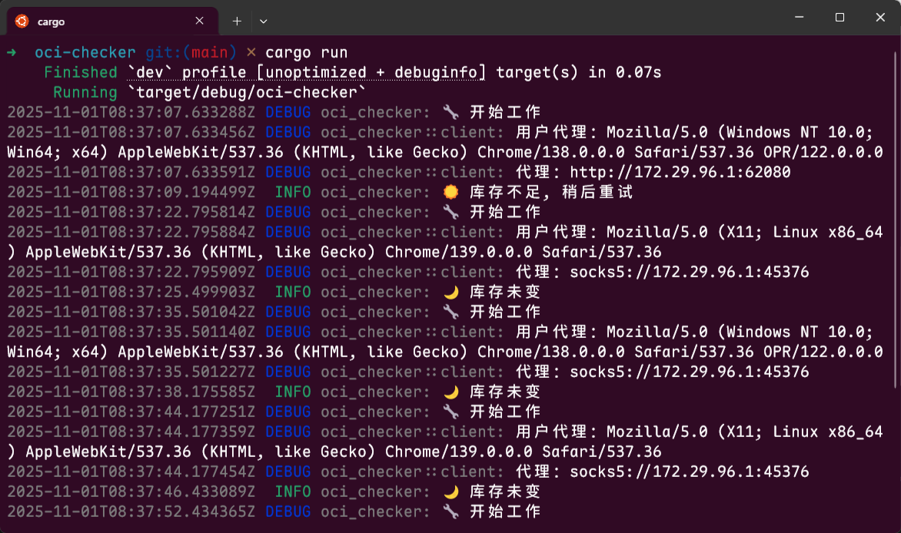
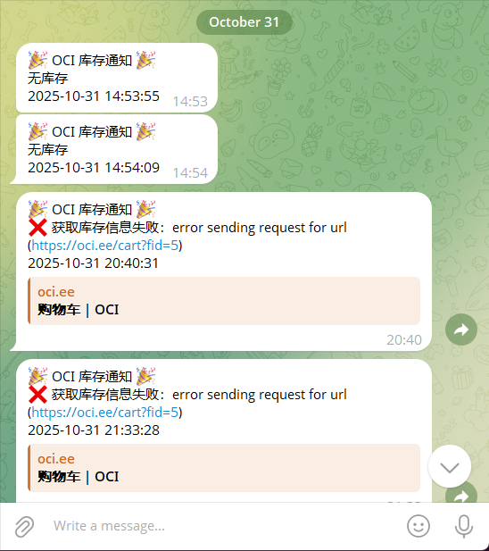

# OCI 免费服务器库存监控

监控 OCI 免费服务器库存，并推送通知到 TG 机器人。

## 二进制文件

由于作者使用的是 WSL 的 Ubuntu 22.04 进行开发，所以提供了 2 个预编译的二进制文件压缩打包好供下载：

- `oci-checker-x86_64-unknown-linux-gnu-ubuntu22.04.tar.gz`：如果你的操作系统也是 Ubuntu 22.04，可以下载此文件
- `oci-checker-x86_64-unknown-linux-musl.tar.gz`： 供其他 Linux 操作系统下载
- 如果你不确定自己的操作系统，可以无脑下载 `musl` 版。

> 你也可以自行编译。

## 环境变量

| 变量名                         | 是否必填 | 默认值                      | 说明                                                                  |
| ------------------------------ | -------- | --------------------------- | --------------------------------------------------------------------- |
| `TG_CHAT_ID`                   | ✅       |                             | 接受通知的 CHAT ID，通常就是用户的 TG ID                              |
| `TG_BOT_TOKEN`                 | ✅       |                             | TG 机器人 TOKEN                                                       |
| `URL`                          |          | `https://oci.ee/cart?fid=5` | 要监控的库存 URL                                                      |
| `PROXIES`                      |          |                             | 代理，多个代理使用英文逗号分割。支持 `HTTP`、`HTTPS` 和 `SOCKS5` 代理 |
| `REQUEST_TIMEOUT`              |          | `10`                        | 网络请求超时（秒）                                                    |
| `CHECK_DURATION_MIN`           |          | `6`                         | 每次检查最小间隔时间（秒）                                            |
| `CHECK_DURATION_MAX`           |          | `12`                        | 每次检查最大间隔时间（秒）                                            |
| `IF_GET_STOCK_FAILED_SEND_MSG` |          | `true`                      | 当获取库存失败时，是否将出错信息发送 TG 通知                          |
| `SKIP_NOTIFY_STOCK_NUM`        |          | `1`                         | 库存低于此值，将不发送通知                                            |
| `RUST_LOG`                     |          | `oci_checker=debug`         | 日志级别                                                              |

## 自托管部署

- 下载对应的二进制，或自行编译。
- 将 `env-example` 重命名为 `.env`
- 根据需要，修改 `.env` 里的配置内容。注意，必须设置必填项。
- 运行 `oci-checker` 即可

如果你不想使用 `.env` 文件，也可以通过命令行直接设置环境变量，比如：

```bash
TG_CHAT_ID='你的CHAT ID' TG_BOT_TOKEN='你的机器人TOKEN' ./oci-checker
```

## 容器化部署

- 将对应版本的二进制文件（容器化通常使用 `musl` 版本）上传到容器内
- 设置环境变量，注意 `TG_CHAT_ID` 和 `TG_CHAT_ID` 环境变量必须设置
- 将容器启动命令设置为 `oci-checker`

## 日志

可以通过环境变量 `RUST_LOG` 来设置，默认值为 `oci_checker=debug`，如果你不想看到调试信息，可以修改为 `oci_checker=info`。

## 截图

截图 1: 正在运行



截图 2: TG 通知


